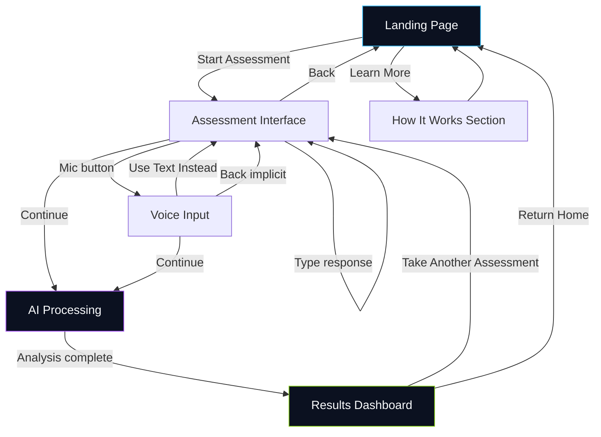

# MindScreen — UI/UX Design Specification

> High-fidelity wireframe and design system for the Mental Health Classifier web application.  
> Inspired by the emotional ray palette and bokeh atmosphere of the reference theme image.

---

## 1. Overview

MindScreen is an AI-powered mental health **screening** platform (not diagnostic) that lets users express thoughts via text or voice, receive guided questions, and view classification results with recommendations.

**Design north star:** Microsoft Copilot's elegance + healthcare-grade trust + emotional warmth from the reference image's color rays.

**Mockup location:** `src/app/index.html` — open directly in a browser or run `python src/app/app.py`.

---

## 2. Color Palette

Derived from the reference image's radiating emotion rays and bokeh spheres.

| Token | Hex | Usage |
|-------|-----|-------|
| `--bg-deep` | `#060912` | Primary page background |
| `--bg-navy` | `#0B1120` | Elevated surfaces, nav |
| `--color-cerulean` | `#38BDF8` | Primary accent, links, AI glow |
| `--color-purple` | `#A855F7` | Secondary accent, gradients |
| `--color-pink` | `#F472B6` | Tertiary gradient stop |
| `--color-lime` | `#84CC16` | Normal / positive states |
| `--color-lemon` | `#FACC15` | Moderate risk, disclaimers |
| `--color-crimson` | `#EF4444` | Stress, high risk |
| `--color-teal` | `#2DD4BF` | Feature accents |
| `--text-primary` | `#F8FAFC` | Headlines, body |
| `--text-secondary` | `rgba(248,250,252,0.72)` | Supporting copy |
| `--text-muted` | `rgba(248,250,252,0.48)` | Labels, metadata |
| `--surface-glass` | `rgba(255,255,255,0.04)` | Glassmorphism cards |
| `--border-glass` | `rgba(255,255,255,0.10)` | Card borders |

### Classification Colors

| Category | Color | Token |
|----------|-------|-------|
| Stress | Crimson `#EF4444` | `--cat-stress` |
| Anxiety | Purple `#A855F7` | `--cat-anxiety` |
| Depression | Cerulean `#38BDF8` | `--cat-depression` |
| Bipolar | Lemon `#FACC15` | `--cat-bipolar` |
| Personality Disorder | Pink `#F472B6` | `--cat-personality` |
| Suicidal Ideation | Deep Red `#DC2626` | `--cat-suicidal` |
| Normal | Lime `#84CC16` | `--cat-normal` |

### Gradient Recipes

```css
/* Primary CTA & AI orb */
linear-gradient(135deg, #38BDF8, #A855F7)

/* Headline accent */
linear-gradient(135deg, #38BDF8, #A855F7, #F472B6)

/* Background rays (conic) */
conic-gradient from 180deg at 50% 55% — lime, crimson, lemon, purple, cerulean
```

---

## 3. Typography

| Role | Font | Weight | Size (desktop) |
|------|------|--------|----------------|
| Display / Headlines | Plus Jakarta Sans | 700–800 | 48–60px (hero) |
| Section titles | Plus Jakarta Sans | 700 | 36px |
| Body | Inter | 400–500 | 16px |
| Labels / Nav | Inter | 500–600 | 14px |
| Scores / Data | JetBrains Mono | 600 | 14px |
| Disclaimers | Inter | 400 | 12–14px |

### Type Scale

- `--text-xs`: 12px — badges, footnotes
- `--text-sm`: 14px — nav, card body
- `--text-base`: 16px — default body
- `--text-lg`: 18px — section subtitles
- `--text-xl`–`--text-6xl`: progressive display scale

### Rationale

- **Plus Jakarta Sans** — modern SaaS personality, friendly curves suitable for healthcare without feeling clinical.
- **Inter** — exceptional readability at all sizes; industry standard for accessible UI.
- **JetBrains Mono** — tabular confidence scores feel precise and trustworthy.

---

## 4. Component Breakdown

### 4.1 Navigation (`nav`)

| Property | Value |
|----------|-------|
| Height | 72px (64px mobile) |
| Background | `rgba(6,9,18,0.72)` + 20px blur |
| Elements | Logo orb, links, Sign In (ghost), Start Assessment (primary) |

### 4.2 AI Orb (`ai-orb`)

Copilot-inspired animated element with three layers:

1. **Glow** — radial pulse, 4s cycle
2. **Ring** — gradient border, 12s rotation
3. **Core** — morphing border-radius, multi-color gradient

Sizes: `sm` (64px), default (120px), `lg` (160px), `xl` (200px)

### 4.3 Buttons

| Variant | Use case |
|---------|----------|
| `btn-primary` | Start Assessment, Continue, CTAs |
| `btn-secondary` | Learn More, Back, secondary actions |
| `btn-ghost` | Sign In, low-emphasis nav |
| `btn-icon` | Microphone toggle |
| `btn-lg` | Hero and flow primary actions |

### 4.4 Glass Card (`glass-card`)

- Background: 4% white + 24px backdrop blur
- Border: 1px glass border
- Radius: 24px (`--radius-2xl`)
- Hover: translateY(-4px) + stronger border (disabled on static results cards)

### 4.5 Hero Section

- Split grid: copy left, orb right (stacked on mobile)
- Trust badges: Privacy, Screening disclaimer, All ages
- Floating orb animation (8s ease)

### 4.6 Step Cards (How It Works)

- 4-column grid with gradient connector line
- Numbered steps with emoji icons (replace with SVG icons in production)
- Collapses to 2×2 tablet, 1-column mobile

### 4.7 Assessment Interface

- AI orb + question header
- Large textarea (min 180px, max 2000 chars)
- Toolbar: mic button + character counter
- Continue / Back actions

### 4.8 Voice Input

- 120px mic button with pulsing ring
- 8-bar waveform animation
- Live transcription panel
- Calm "Listening..." status in cerulean

### 4.9 Processing Screen

- XL orb + shimmer text animation
- Three bouncing dots (cerulean, purple, pink)
- Auto-advances to results after 3.2s (demo)

### 4.10 Results Dashboard

- Risk badge (moderate/high/low)
- Classification list with progress bars
- Donut chart with center primary percentage
- Explanation panel + recommendations list
- Prominent disclaimer banner (lemon/warning style)

### 4.11 Feature Cards

- 3×2 grid (3-col desktop → 2-col tablet → 1-col mobile)
- Color-coded icon backgrounds per feature category

### 4.12 Footer

- 4-column grid: brand, product, legal, resources
- Persistent screening disclaimer

---

## 5. Layout Specifications

### Desktop (≥1200px)

```
┌─────────────────────────────────────────────────────────────┐
│  NAV: Logo · Links · Sign In · [Start Assessment]           │
├─────────────────────────────────────────────────────────────┤
│  HERO                                                        │
│  ┌──────────────────────┐  ┌──────────────────────┐         │
│  │ Headline + CTAs      │  │     AI Orb (XL)      │         │
│  │ Trust badges         │  │                      │         │
│  └──────────────────────┘  └──────────────────────┘         │
├─────────────────────────────────────────────────────────────┤
│  HOW IT WORKS — 4 cards with connector line                 │
├─────────────────────────────────────────────────────────────┤
│  ASSESSMENT PREVIEW — glass chat mockup                     │
├─────────────────────────────────────────────────────────────┤
│  FEATURES — 3×2 grid                                        │
├─────────────────────────────────────────────────────────────┤
│  FOOTER — 4 columns + disclaimer                            │
└─────────────────────────────────────────────────────────────┘
```

**Max content width:** 1200px  
**Section padding:** 80px vertical  
**Grid gap:** 24px

### Tablet (768px–1024px)

- Hero stacks vertically (orb above copy)
- Steps: 2×2 grid, connector hidden
- Features: 2 columns
- Results: single column

### Mobile (≤768px)

- Hamburger navigation
- Full-width buttons in hero CTAs
- Single-column everything
- Reduced orb size (140px hero)
- Flow screens: full-bleed with 16px padding
- Bottom wireframe nav wraps

---

## 6. User Flow Diagram



### Flow Screens (Interactive Mockup)

Use the bottom-left **wireframe navigation** to jump between:

1. **Landing** — full marketing page
2. **Assessment** — conversational input
3. **Voice** — speech-to-text experience
4. **Processing** — AI analysis loading
5. **Results** — classification dashboard

Primary user path: Landing → Assessment → Processing → Results

---

## 7. UI/UX Rationale by Section

### Hero Section

**Goal:** Immediate emotional safety and clarity of purpose.

- Dark navy background with soft bokeh creates a calm, premium atmosphere — not a sterile clinical waiting room.
- The animated AI orb signals intelligence without anthropomorphizing a therapist (avoiding false intimacy).
- Dual CTAs: "Start Assessment" (action) vs "Learn More" (education) respect different user readiness levels.
- Trust badges address top anxieties: privacy, non-diagnosis, inclusivity.

### How It Works

**Goal:** Reduce uncertainty about what happens to user data and time.

- Four steps map 1:1 to the actual product flow.
- Connecting gradient line reinforces progression and mirrors the reference image's rays.
- Floating card animation adds life without distraction (`prefers-reduced-motion` respected).

### Assessment Interface

**Goal:** Feel like ChatGPT/Copilot — familiar, low-friction, non-judgmental.

- Open-ended textarea before structured questions lowers the barrier to entry ("rant freely").
- AI orb as assistant avatar provides continuity without a human face (avoids uncanny valley and false clinical authority).
- Character counter prevents anxiety about limits; turns amber near max.
- Voice toggle always visible — accessibility for users who struggle to type when distressed.

### Voice Input

**Goal:** Calm, reassuring alternative input modality.

- Large central mic button — clear affordance, easy motor target.
- Pulsing ring and waveform confirm the system is listening (critical for trust).
- Live transcription lets users verify accuracy before continuing.
- Muted color palette; no aggressive red "recording" indicators.

### AI Processing

**Goal:** Manage wait anxiety during inference.

- Familiar orb animation maintains brand continuity.
- Shimmer text communicates active work without a generic spinner.
- Brief, predictable duration (3s in mockup) — production should show progress stages if longer.

### Results Dashboard

**Goal:** Professional, actionable, responsibly framed.

- Confidence percentages with color-coded bars — scannable for researchers and lay users.
- Donut chart provides at-a-glance primary classification.
- Risk badge uses moderate yellow (not alarmist red unless warranted).
- Explanation in plain language bridges AI output to human understanding.
- Recommendations are concrete and non-prescriptive.
- **Disclaimer banner is visually prominent** — ethical requirement for screening tools.

### Features & Footer

**Goal:** Credibility for research panels and professionals.

- Feature grid communicates technical capability without overwhelming.
- Footer consolidates legal, research, and crisis guidance.

---

## 8. Accessibility Checklist

- [x] Skip to main content link
- [x] Semantic HTML (`nav`, `main`, `section`, `article`, `footer`)
- [x] ARIA labels on icon buttons and live regions (char counter, voice status)
- [x] `:focus-visible` outlines on interactive elements
- [x] Color contrast: text-primary on bg-deep exceeds WCAG AA
- [x] `prefers-reduced-motion` disables animations
- [x] Touch targets ≥ 48px on mobile (buttons, mic)
- [x] Results chart has text alternative via `aria-label`

---

## 9. Animation Inventory

| Animation | Duration | Element |
|-----------|----------|---------|
| `float` | 6–8s | Hero orb, step cards |
| `orb-morph` | 8s | AI orb core |
| `orb-spin` | 12s | AI orb ring |
| `bokeh-drift` | 16–25s | Background spheres |
| `ray-pulse` | 8s | Background conic gradient |
| `waveform` | 1s | Voice input bars |
| `shimmer` | 3s | Processing text |
| `progress-fill` | 1.2s | Result bar charts |
| `fade-in-up` | 0.7s | Scroll reveal |

---

## 10. Running the Mockup

### Option A — Direct file

Open `src/app/index.html` in any modern browser.

### Option B — Flask server

```bash
pip install flask
python src/app/app.py
# Visit http://localhost:5000
```

---

## 11. Production Next Steps

1. Replace emoji step icons with custom SVG icon set
2. Connect assessment flow to `src/inference/predict.py` backend API
3. Integrate Web Speech API for real voice input
4. Add authentication and session management
5. Implement i18n for multilingual support
6. User testing with mental health professionals and target demographics
7. Clinical review of disclaimer language and recommendation copy

---

## 12. File Structure

```
src/app/
├── index.html          # Complete wireframe (all sections + flow views)
├── app.py              # Flask dev server
├── DESIGN.md           # This document
├── assets/
│   └── theme-reference.png
├── css/
│   ├── variables.css   # Design tokens
│   ├── animations.css  # Keyframes & motion
│   ├── main.css        # Base layout & typography
│   └── components.css  # Component styles
└── js/
    └── app.js          # View navigation & interactions
```

---

*MindScreen UI Mockup v1.0 — RLIP Mental Health AI Project*
